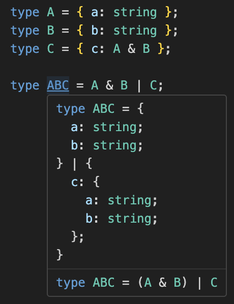

# Prettify TypeScript

**Get useful type information where you need it**

[](https://marketplace.visualstudio.com/items?itemName=MylesMurphy.prettify-ts)
[](https://github.com/mylesmmurphy/prettify-ts)
[](https://marketplace.visualstudio.com/items?itemName=username.repo)
[](https://github.com/mylesmmurphy/prettify-ts/blob/main/LICENSE)

Prettify TS is a Visual Studio Code extension that enhances your TypeScript development experience. It provides hover information for TypeScript types, classes, interfaces, and more, formatted in a more readable and configurable way.

## Example


## Features

- **Hover Information**: Just hover over a type, class, interface, etc., and you'll see a prettified version of its declaration in the hover panel.

- **Sidebar**: Open the Prettify TS sidebar to view menu options and types.

## Extension Settings

Prettify TS can be configured to customize your TypeScript development experience. Some settings are available in the extension's menu panel on the sidebar, allow you to easily adjust certain options.

For more advanced settings, like ignoring specific types from Prettification, you can access the Visual Studio Code extension settings. Visual Studio Code extension settings can be found by navigating to the Settings editor and searching for the specific extension by name.

## Commands

Use the `Prettify TS: Toggle Hover` command to enable or disable the hover information feature provided by the Prettify-ts extension.

Use the `Prettify TS: Toggle View Nested Types` command to show or hide nested type information.

## How it works

The core function of this extension is accomplished by virtually integrating a [`Prettify`](https://www.totaltypescript.com/concepts/the-prettify-helper) generic into your project. This generic acts as a powerful tool that takes TypeScript types and transforms them into a more readable format.

To achieve this, Prettify TS utilizes the ts-morph library to pass your type to the generic in a virtual replica of your code. It's important to note that the Prettify generic is only added to this virtual copy, and not to your actual codebase.

```typescript
type Prettify<T> = T extends String | Number | Boolean
    ? T
    : T extends (...args: infer A) => infer R
    ? (...args: { [K in keyof A]: Prettify<A[K]> } & unknown) => Prettify<R>
    : T extends Promise<infer U>
    ? Promise<Prettify<U>>
    : T extends Array<infer U>
    ? Prettify<U>[]
    : T extends object
    ? { [P in keyof T]: Prettify<T[P]> } & unknown
    : T

type Input = Promise<{ a: number, b: string }>;
type Output = Prettify<Input>;
// Original Output Hint: Promise<Input>
// Prettified Output Hint: Promise<{ a: number; b: string; }>
```

## Contributing

Contributions are welcome! Please open an issue if you encounter any problems or have a feature request.

## Acknowledgements

Thank you for trying out this extension! A special mention to [@mattpocock](https://github.com/mattpocock) for the Prettify Type, [@willbattel](https://github.com/willbattel) for beta testing, and [@mattiamanzati](https://github.com/mattiamanzati) for their TypeScript expertise.

## License

MIT
