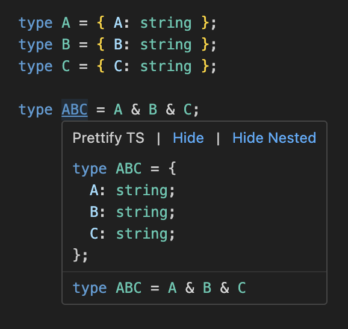
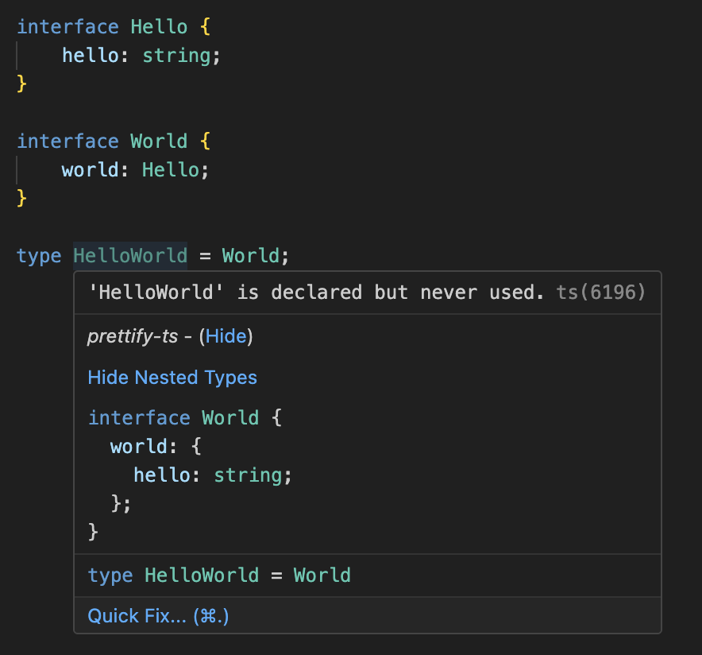
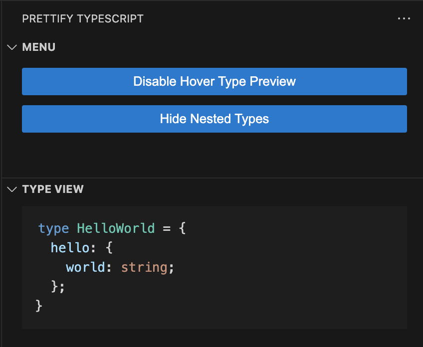

# Prettify TypeScript

Prettify TS is a Visual Studio Code extension that enhances your TypeScript development experience. It provides hover information for TypeScript types, classes, interfaces, and more, formatted in a more readable and configurable way.

## Example

## Features

- **Hover Information**: Just hover over a type, class, interface, etc., and you'll see a prettified version of its declaration in the hover panel.

- **Sidebar**: Open the Prettify TS sidebar to view menu options and types.

## Usage

1. Install the extension from the Visual Studio Code marketplace.
2. Open a TypeScript file in Visual Studio Code.
3. Hover over a type, class, interface, etc., to see the prettified declaration in a hover panel.
4. Or, open the Prettify TS option on the sidebar to view menu options and types.

## Toggle

Use the `Prettify TS: Toggle Hover` command to enable or disable the hover information feature provided by the Prettify-ts extension.

Use the `Prettify TS: Toggle View Nested Types` command to show or hide nested type information.

## Contributing

Contributions are welcome! Please open an issue if you encounter any problems or have a feature request.

## Note from the developer:

Thanks for trying my extension! Special thanks to [@mattpocock](https://github.com/mattpocock) for the Prettify Type, [@willbattel](https://github.com/willbattel) for beta testing, and [@mattiamanzati](https://github.com/mattiamanzati) for help with TypeScript questions.

## License

MIT
