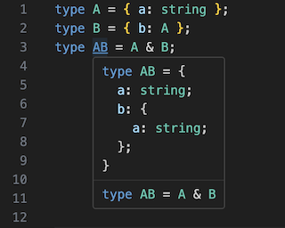

# Prettify TypeScript

**Get useful type information where you need it**

Prettify TS is a Visual Studio Code extension that enhances your TypeScript development experience. It provides better hover previews for TypeScript types, classes, interfaces, and more, formatted in a more readable and highly configurable way.

## Example

## Features

- **Hover Information**: Just hover over a type, class, interface, etc., and you'll see a prettified version in the hover panel.
- **Toggle Preview**: Use the `Prettify TS: Toggle Preview` command to enable or disable the prettified hover preview.
- **Copy Prettified Type**: Use the `Prettify TS: Copy Prettified Type` command to copy the prettified type to the clipboard.

## Extension Settings

Prettify TS can be configured to customize your TypeScript development experience. Visual Studio Code extension settings can be found by navigating to the Settings editor and searching for the specific extension by name.

The following settings are available:

- **Type Indentation**: Controls the indentation level of types.
- **Max Depth**: Sets the maximum depth to which types should be expanded.
- **Max Properties**: Limits the number of properties displayed for each type. Excess properties will be displayed with ellipsis.
- **Max Sub-Properties**: Limits the number of sub-properties (properties on nested objects) displayed for each property. Excess properties will be displayed with ellipsis.
- **Max Union Members**: Limits the number of union members displayed for each union. Excess members will be displayed with ellipsis.
- **Unwrap Functions**: If enabled, function parameters and return types will be expanded.
- **Unwrap Arrays**: If enabled, array element types will be expanded.
- **Unwrap Generic Arguments Type Names**: A list of generic type names whose arguments will be unwrapped, instead of the apparent (final) type. Regex supported.
- **Hide Private Properties**: If enabled, hides private properties and methods.
- **Skipped Type Names**: A list of type names that should not be expanded. Regex supported.
- **Max Characters**: Sets the maximum number of characters for the prettified output. If the output exceeds this limit, it will be truncated.

*Note: All regex patterns are automatically wrapped with `^` at the start and `$` at the end.*

## Sidebar Type View (Deprecated)

As of v0.1.0, Prettify TS has been rescoped to hover previews only and no longer supports a VSCode Type Preview View Container. For feature rich projects offering TypeScript Type View Containers, check out the following:

- [TypeScript Explorer](https://marketplace.visualstudio.com/items?itemName=mxsdev.typescript-explorer)
- [ts-type-expand](https://marketplace.visualstudio.com/items?itemName=kimuson.ts-type-expand)

## Contributing

Contributions are welcome! Please open an issue if you encounter any problems or have a feature request.

## Acknowledgements

A special mention to [@mattpocock](https://github.com/mattpocock) for the Prettify Type on which this project was based, [@willbattel](https://github.com/willbattel) for beta testing, and [@mattiamanzati](https://github.com/mattiamanzati) for their TypeScript expertise.

## License

MIT
