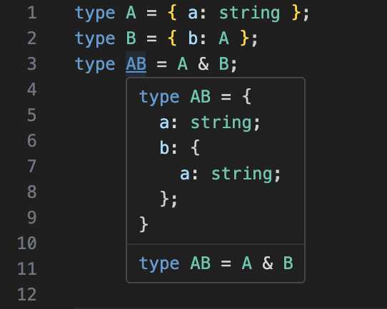

# Prettify TypeScript

**Readable, structured, and useful TypeScript type information where it matters most: right in your editor.**

## 🧠 Overview

Prettify TS is a Visual Studio Code extension that enhances your TypeScript development experience by transforming complex type hover previews into clean, readable, and structured displays.

Whether you're working with deeply nested generics, unions, mapped types, or conditional logic, Prettify TS formats and presents types in a way that's easy to digest.

## 📸 Example

## ✨ Features

* **Prettified Type Hovers**: Clean and collapsible previews for interfaces, type aliases, function signatures, unions, arrays, tuples, and more.
* **Toggle Command**: `Prettify TS: Toggle Preview` lets you quickly switch between default and prettified views.
* **Copy Commands**: Easily copy a prettified type with `Prettify TS: Copy Prettified Type` or `Copy Fully Prettified Type`.
* **Highly Configurable**: Tune everything from indentation levels to expansion depth and union truncation.

## ⚙️ Settings

You can configure Prettify TS by searching `Prettify TS` in your VSCode settings. Key options include:

| Setting                           | Description                                                                 |
| --------------------------------- | --------------------------------------------------------------------------- |
| `prettify-ts.enabled`             | Globally enable or disable the extension.                                   |
| `typeIndentation`                 | Controls how many spaces to use per indent level.                           |
| `maxDepth`                        | Maximum depth of nested types to traverse.                                  |
| `maxProperties`                   | Max number of properties to show before truncating.                         |
| `maxSubProperties`                | Max sub-properties per object.                                              |
| `maxUnionMembers`                 | Max number of union members to display.                                     |
| `maxFunctionSignatures`           | Max function overloads to display.                                          |
| `unwrapFunctions`                 | Expand function signatures inline.                                          |
| `unwrapArrays`                    | Expand array element types.                                                 |
| `unwrapGenericArgumentsTypeNames` | Type names to always unwrap generics for (e.g., `Promise`, `Set`).          |
| `hidePrivateProperties`           | Hide private class/interface members.                                       |
| `skippedTypeNames`                | Skip formatting for listed types (e.g., `Array`, `Date`, `ZodObject<...>`). |
| `maxCharacters`                   | Trim output beyond a certain character limit.                               |

## 🧪 Example Use Cases

* Quickly inspect mapped types, infer types, or generics.
* Get clean previews of large interfaces with union types.
* Debug tricky conditional or template literal types.

## ❌ Sidebar View (Deprecated)

As of v0.1.0, Prettify TS focuses purely on hover previews and no longer includes a sidebar type explorer. For sidebar alternatives, consider:

* [TypeScript Explorer](https://marketplace.visualstudio.com/items?itemName=mxsdev.typescript-explorer)
* [ts-type-expand](https://marketplace.visualstudio.com/items?itemName=kimuson.ts-type-expand)

## 🤝 Contributing

Bug reports, feature suggestions, and pull requests are welcome. See [GitHub Issues](https://github.com/mylesmmurphy/prettify-ts/issues) to get started.

## 🙏 Acknowledgements

* [@mattpocock](https://github.com/mattpocock) — original inspiration via Prettify Type
* [@willbattel](https://github.com/willbattel) — early beta testing and feedback
* [@mattiamanzati](https://github.com/mattiamanzati) — TypeScript compiler insights

## 📝 License

[MIT](https://github.com/mylesmmurphy/prettify-ts/blob/main/LICENSE)
